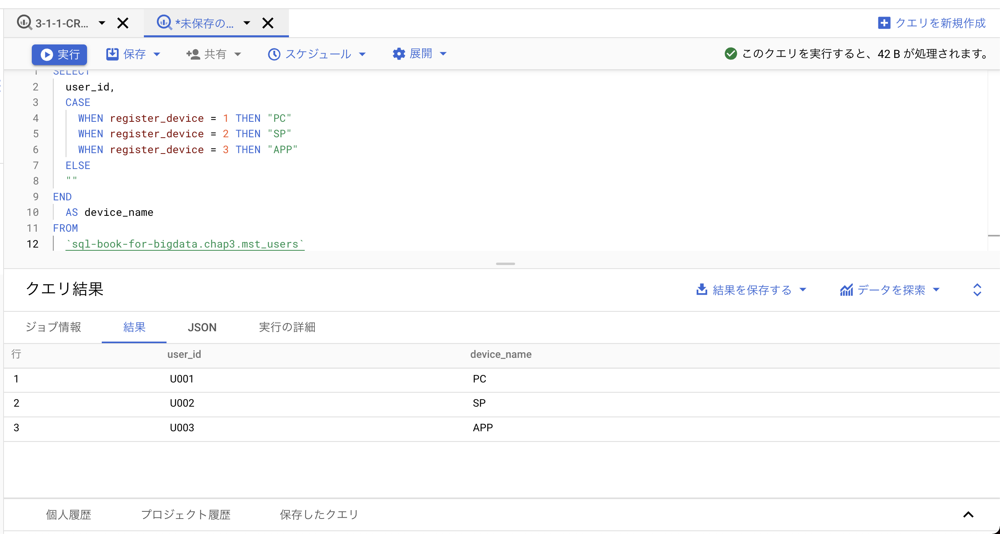

# はじめに

データアナリストや機械学習エンジニアをしている方々の中には、pythonやRは書けるけどSQLには馴染みがない方は多いかと思います。かく言う自分もインターンでするまではSQLに触れたことはありませんでした。
そんな当時SQL初心者であった自分がSQLを勉強した本が『ビッグデータ分析・活用のためのSQLレシピ』でした。データを使用するアナリストや機械学習エンジニアがはじめに手をつけるにはうってつけの本であると思います。
一方で、手を動かしながら『ビッグデータ分析・活用のためのSQLレシピ』を読み進めようとすると初学者にはいくつかのハマりポイントが存在します。例えば、『ビッグデータ分析・活用のためのSQLレシピ』にはクエリを実行するサンプルコードは記載がありますが、どのようにダミーデータをデーブルに保存するかなどは記載がありません。ここで詰まってしまうことで手を動かしながら読み進めることを諦めてしまった人も多いのではないでしょうか？
本記事ではそれらの問題点をBigQueryを用いることで解決し、初学者でも苦労なくSQLの勉強を開始できるようになることを目指します。
## 想定読者
- SQLを勉強したい
- 『ビッグデータ分析・活用のためのSQLレシピ』を実際に手を動かしながら勉強したい
- 『ビッグデータ分析・活用のためのSQLレシピ』を購入はしたが活用方法がイマイチはっきりしていない
- BigQueryを触ってみたい

# 『ビッグデータ分析・活用のためのSQLレシピ』について
本記事ではSQLに入門することに主眼を置くため、『ビッグデータ分析・活用のためのSQLレシピ』がどのような本であるかの説明は省略します。
どのような本であるかの詳細を知りたい場合は[こちら](https://tjo.hatenablog.com/entry/2017/04/12/233208)などを参照すると良いでしょう。
サポートサイトは[こちら](https://book.mynavi.jp/supportsite/detail/9784839961268.html)になります。サポートサイトからはダミーデータをダウンロードできるため後ほど利用します。
# BigQueryではじめる
以下の手順によって手を動かしながら『ビッグデータ分析・活用のためのSQLレシピ』を読める様になることを目指します。
1. Googleのアカウントを作成する。（持っていない場合）
1. GCP(Google Cloud Platform)のアカウントを作成する。（持っていない場合）
1. GCPで新しいプロジェクトを作成する。
1. 『ビッグデータ分析・活用のためのSQLレシピ』サポートサイトからダミーデータをダウンロードする。
1. ダミーデータをテーブルに保存する。
1. 実際にクエリを書いてみる
## Googleのアカウントを作成する
[Google公式サイト](https://support.google.com/accounts/answer/27441?hl=ja)を参考にGoogleアカウントを作成します。
## GCP(Google Cloud Platform)のアカウントを作成する
[こちらのサイト](https://www.purin-it.com/make-gcp-account)を参考にGCPアカウントを作成します。
途中クレジットカード情報の入力を求められますが、300ドル分を最大12ヶ月無料で試用できるため今回は無料で利用できます。
## GCPで新しいプロジェクトを作成する
[Google公式サイト](https://cloud.google.com/apigee/docs/hybrid/v1.2/precog-gcpproject?hl=ja)を参考にしてGCPで新しいプロジェクトを作成してください。
プロジェクトの名前やIDは何でも良いのですが今回、
- プロジェクト名：`sql-book-for-bigdata.chap3`
- プロジェクトID：`sql-book-for-bigdata.chap3`
で設定したプロジェクトを例に進めていくので同じに名前・IDにしておくと混乱が少ないかもしれません。

こちらが完了したらGCPでの設定はほぼ完了です。
## 『ビッグデータ分析・活用のためのSQLレシピ』サポートサイトからダミーデータをダウンロードする
ダミーデータをダウンロードするために[サポートサイト](https://book.mynavi.jp/supportsite/detail/9784839961268.html)にアクセスしてください。
`ダウンロードデータ`のとろこにある`SQL_Recipe_sample-code_20170325.zip`をクリックするとダウンロードが開始されます。

*サポートサイト参考画像*
## ダミーデータをテーブルに保存する
### ダウンロードしたダミーデータを確認する。
まずVScodeでもなんでもいいので先程ダウンロードしたダミーデータを開きます。
そして`Chapter3/3-1-1-data.sql`を開いて見てください。以下の画像のようなコードが記載されていることが確認できるかと思います。


### ダウンロードしてきたダミーデータからBigQueryにテーブルを作成する
試しに`Chapter3/3-1-1-data.sql`のデータをBigQueryのテーブルに保存してみます。
まず、GCPのナビゲーションメニューから`BigQuery`を探し出して`SQLワークスペース`移動します。すると以下のような画面になっていると思われます。

画像の画面に遷移できたら`sql-book-for-bigdata.chap3`のよこの縦三点リーダーをクリックして**データセットを作成**をクリックします。すると以下のような画面に移ります。

今回はChapter3のダミーデータを作成したいので、
- データセットID：chap3
- データのロケーション：asia-northeast1 (東京)
としておきましょう。（データのロケーションはどこでも良いです）
データセットを作成をクリックするとエクスプローラーから`sql-book-for-bigdata`のもとに`chap3`が作成されたことが確認できます。
次に、`Chapter3/3-1-1-data.sql`のコード（下記のコード）をコピーします。
```SQL
DROP TABLE IF EXISTS mst_users;
CREATE TABLE mst_users(
    user_id         varchar(255)
  , register_date   varchar(255)
  , register_device integer
);

INSERT INTO mst_users
VALUES
    ('U001', '2016-08-26', 1)
  , ('U002', '2016-08-26', 2)
  , ('U003', '2016-08-27', 3)
;
```
そして、コピーしたものをエディタに貼り付けをします。
その後、貼り付けたものを以下のように編集します。
```SQL
DROP TABLE IF EXISTS `sql-book-for-bigdata.chap3.mst_users`;
CREATE TABLE `sql-book-for-bigdata.chap3.mst_users` (
    user_id         STRING
  , register_date   DATETIME
  , register_device INT64
);

INSERT INTO `sql-book-for-bigdata.chap3.mst_users`
VALUES
    ('U001', '2016-08-26', 1)
  , ('U002', '2016-08-26', 2)
  , ('U003', '2016-08-27', 3)
;
```
今、エディタの画面が以下の画像のようになっていればOKです。


編集したのは以下の点です。
`sql-book-for-bigdata`の部分には自身が設定したプロジェクトIDが入ります。
```diff SQL
+ DROP TABLE IF EXISTS `sql-book-for-bigdata.chap3.mst_users`;
- DROP TABLE IF EXISTS mst_users;

+ CREATE TABLE `sql-book-for-bigdata.chap3.mst_users` (
+     user_id         STRING
+  , register_date   DATETIME
+   , register_device INT64
+ );
- CREATE TABLE mst_users(
-    user_id         varchar(255)
-   , register_date   varchar(255)
-  , register_device integer
- );

+ INSERT INTO `sql-book-for-bigdata.chap3.mst_users`
- INSERT INTO mst_users
```
エディタの`実行`をクリックすると`mst_users`という名前のテーブルが`chap3`のもとに作成されます。
これで本に記載のあるクエリを実行できるようになりました！！
### 他のダミーデータを追加したい時
今回は`Chapter3/3-1-1-data.sql`のダミーデータをBigQueryで利用できるようにしました。同様の手順を踏むことによって他のダミーデータもBigQueryで活用できるようになります。
すべてのダミーデータをBigQueryに保存しようとすると多少面倒かと思われるので、「実際にクエリを書いてみて、結果を確認してみたい！」となったダミーデータだけを保存するようにするのがいいと思われます。
### 補足
今回はさくっとSQLに入門することが目的であるため深堀りはしませんが疑問に思われるであろう点の補足をします。
- テーブル名について
BigQueryではテーブルを参照する際に
`{project-id}.{dataset-id}.{table-name}`で参照する必要があります。
そのため`mst_users`を`sql-book-for-bigdata.chap3.mst_users`へと変更する必要があったのです。

- 型について
`varchar(255)`や`integer`といった型はBigQueryではサポートされていないため適宜変更してあげる必要があります。
これに関しては[公式ドキュメント](https://cloud.google.com/bigquery/docs/reference/standard-sql/data-types?hl=ja)を参照するのが良いと思われます。
 
# 実際にクエリを書いてみる
では、実際に保存したテーブルから欲しいデータを抽出するためのクエリを書いてみましょう。
『ビッグデータ分析・活用のためのSQLレシピ』27ページの`コード3.1.1.1:コードをラベルに置き換えるクエリ`を実行してみたいと思います。
BigQueryのエディタに以下のクエリを書いて実行します。
```SQL
SELECT
  user_id,
  CASE
    WHEN register_device = 1 THEN "PC"
    WHEN register_device = 2 THEN "SP"
    WHEN register_device = 3 THEN "APP"
  ELSE
  ""
END
  AS device_name
FROM
  `sql-book-for-bigdata.chap3.mst_users`
```
以下のような結果が得られれば成功です。


これにてダミーデータをBigQueryに保存して、自身で実際にクエリを叩いてみるという一連の流れが完了です。お疲れ様でした。

今回は1つのダミーデータのみを保存・クエリの実行を行いましたが他のダミーデータも同様の手順を踏むことによってBigQueryに保存することが可能です。
ぜひ他のデータも保存して実際にクエリを書いてみてください！
# 最後に
今回は自分がSQLを勉強した際に活用した『ビッグデータ分析・活用のためのSQLレシピ』をBigQueryを使って勉強する方法を紹介しました。
SQLがスラスラ書けると機械学習を使いたいときの特徴量作成なども高速に行うことができるようになったりと様々な恩恵があるので是非SQLに入門してみてください！
何かのお役に立てていれば幸いです。


